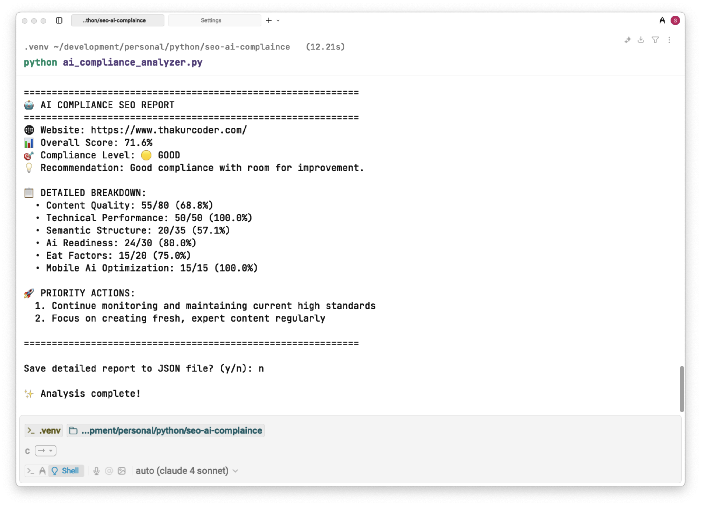

# 🤖 AI Compliance SEO Analyzer

A comprehensive Python tool for analyzing websites' AI compliance factors in modern SEO (2025). This analyzer evaluates websites based on the latest AI-driven search engine requirements and provides actionable insights for improving AI compliance.

## 🌟 Features

### 📊 Comprehensive Analysis
- **Content Quality Assessment**: Analyzes content depth, semantic richness, and readability
- **Technical Performance**: Evaluates SSL security, page speed, mobile-friendliness, and clean URLs
- **Semantic Structure**: Checks structured data, semantic HTML, and meta optimization
- **AI Readiness**: Assesses conversational content, question-answering capabilities, and contextual clarity
- **E-E-A-T Factors**: Evaluates Experience, Expertise, Authoritativeness, and Trustworthiness
- **Mobile & AI Optimization**: Analyzes responsive design and Core Web Vitals

### 🔍 Smart Crawling
- Intelligent website crawling with configurable page limits
- Respectful crawling with built-in delays
- Internal link discovery and analysis
- Error handling and graceful failure recovery

### 📈 Detailed Reporting
- Overall compliance score with percentage breakdown
- Category-specific scoring and recommendations
- Priority action items for improvement
- Exportable JSON reports with timestamps
- Visual compliance level indicators

## 🚀 Quick Start

### Prerequisites
- Python 3.7 or higher
- pip (Python package installer)

### Installation

1. **Clone the repository**
   ```bash
   git clone https://github.com/thakurcoderz/ai_compliance_seo_analyzer.git
   cd ai_compliance_seo_analyzer
   ```

2. **Install dependencies**
   ```bash
   pip install -r requirements.txt
   ```

3. **Run the analyzer**
   ```bash
   python ai_compliance_analyzer.py
   ```

### Usage

1. **Interactive Mode**
   ```bash
   python ai_compliance_analyzer.py
   ```
   - Enter the website URL when prompted
   - Specify the number of pages to analyze (default: 5)
   - Choose whether to save the detailed report

2. **Example Output**
   ```
   🤖 Starting AI Compliance Analysis for: https://example.com
   ============================================================
   🕷️  Crawling website (max 5 pages)...
   ✅ Analyzed: https://example.com
   ✅ Analyzed: https://example.com/about
   📊 Crawled 2 pages successfully
   
   📝 Analyzing Content Quality for AI Compliance...
   Content Quality Score: 65/80
   
   ⚡ Analyzing Technical Performance...
   ✅ SSL Certificate detected
   Technical Performance Score: 45/50
   
   🧠 Analyzing Semantic Structure...
   Semantic Structure Score: 25/35
   
   🤖 Analyzing AI Readiness...
   AI Readiness Score: 20/30
   
   🏆 Analyzing E-E-A-T Factors...
   E-E-A-T Score: 15/20
   
   📱 Analyzing Mobile & AI Optimization...
   ✅ Responsive design detected
   ✅ Good response time detected
   Mobile & AI Optimization Score: 15/15
   ```

   

## 📋 Analysis Categories

### 1. Content Quality (80 points max)
- **Content Depth**: Evaluates word count and content length
- **Semantic Richness**: Analyzes heading structure and organization
- **Readability**: Assesses paragraph structure and content flow
- **Keyword Optimization**: Basic keyword presence analysis

### 2. Technical Performance (50 points max)
- **SSL Security**: HTTPS implementation check
- **Page Speed**: Response time analysis
- **Mobile-Friendly**: Viewport meta tag detection
- **Clean URLs**: URL structure evaluation

### 3. Semantic Structure (35 points max)
- **Structured Data**: JSON-LD, Microdata, RDFa detection
- **Semantic HTML**: HTML5 semantic elements usage
- **Meta Optimization**: Title and description optimization

### 4. AI Readiness (30 points max)
- **Conversational Content**: Tone and engagement indicators
- **Question Answering**: Q&A format detection
- **Contextual Clarity**: Clear section organization

### 5. E-E-A-T Factors (20 points max)
- **Author Information**: Author attribution detection
- **Credibility Signals**: Trust indicators and policies
- **Content Freshness**: Date and timestamp analysis

### 6. Mobile & AI Optimization (15 points max)
- **Responsive Design**: Mobile-friendly implementation
- **Core Web Vitals**: Performance metrics approximation

## 📊 Scoring System

- **🟢 EXCELLENT (80-100%)**: Highly AI-compliant website
- **🟡 GOOD (60-79%)**: Good compliance with room for improvement
- **🟠 MODERATE (40-59%)**: Moderate compliance - needs attention
- **🔴 POOR (0-39%)**: Poor compliance - significant improvements needed

## 🔧 Configuration

### Customizing Analysis Parameters

You can modify the analysis parameters in the `AIComplianceSEOAnalyzer` class:

```python
# Adjust scoring weights
self.max_score = 250  # Total maximum score

# Modify crawling behavior
max_pages = 10  # Number of pages to analyze
crawl_delay = 1  # Delay between requests (seconds)

# Customize user agent
self.session.headers.update({
    'User-Agent': 'Your Custom User Agent'
})
```

### Environment Variables

Create a `.env` file for configuration:

```env
# Crawling settings
MAX_PAGES=10
CRAWL_DELAY=1
TIMEOUT=10

# Analysis settings
MIN_WORD_COUNT=300
MIN_HEADINGS=3
```

## 📁 Project Structure

```
seo-ai-complaince/
├── ai_compliance_analyzer.py    # Main analyzer script
├── requirements.txt             # Python dependencies
├── README.md                   # This file
├── .gitignore                  # Git ignore patterns
└── ai_compliance_report_*.json # Generated reports (ignored by git)
```

## 🛠️ Dependencies

- **requests**: HTTP library for web requests
- **beautifulsoup4**: HTML parsing and navigation
- **urllib3**: HTTP client library
- **lxml**: XML and HTML processing

## 🔍 How It Works

1. **Website Crawling**: The tool crawls the specified website, discovering internal pages
2. **Content Analysis**: Each page is analyzed for content quality, structure, and AI readiness
3. **Technical Assessment**: Technical factors like SSL, speed, and mobile optimization are evaluated
4. **Semantic Evaluation**: Structured data and semantic HTML usage is assessed
5. **AI Compliance Scoring**: All factors are weighted and scored according to AI compliance standards
6. **Report Generation**: A comprehensive report with scores, recommendations, and priority actions is generated

## 🎯 Use Cases

- **SEO Professionals**: Evaluate client websites for AI compliance
- **Web Developers**: Ensure websites meet modern AI-driven SEO requirements
- **Content Creators**: Optimize content for AI search engines
- **Digital Marketers**: Understand AI compliance factors for better rankings
- **Website Auditors**: Comprehensive AI compliance assessment

## 🤝 Contributing

We welcome contributions! Please feel free to submit issues, feature requests, or pull requests.

## ⚠️ Disclaimer

This tool is for educational and analysis purposes. Always respect website robots.txt files and terms of service. The analysis results are estimates and should be used as guidance rather than definitive SEO advice.

## 🔄 Updates

Stay updated with the latest AI compliance factors and SEO best practices. This tool is regularly updated to reflect the latest search engine requirements.

---

**Made with ❤️ for the SEO community**